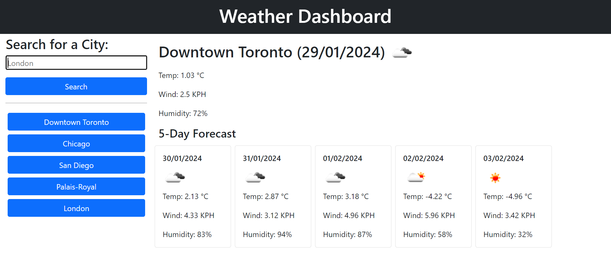

# Weather-Dashboard
Module 8 Challege for edX Bootcamp

## Description
A weather dashboard displaying today's forecast & those of the next five days in a city of the user's choice.

## Usage
Type in a city name and hit Search. The current weather forecast will be displayed at the top of the page and cards will appear below containing the forecast for the next five days.

## Some (Unnecessary) Details
Used HTML, Bootstrap, CSS, JS, jQuery and the OpenWeather API. Man oh man, was the API usage confusing! What a learning curve. Must improve pseudo-code/logic process before jumping into the code editor & stop cramming everything into one looong function. Things to improve on!

## Link to Deployed Site:

https://blooshroo.github.io/Weather-Dashboard/

## Screenshot:

